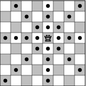

# Verival_T1
**Trabalho 1 da matéria Verificação e Validação de Software**

## Enunciado do Beecrowd

**Link para o problema**: [https://judge.beecrowd.com/pt/problems/view/1087](https://judge.beecrowd.com/pt/problems/view/1087)

O jogo de xadrez possui várias peças com movimentos curiosos: uma delas é a dama, que pode se mover qualquer quantidade de casas na mesma linha, na mesma coluna, ou em uma das duas diagonais, conforme exemplifica a figura abaixo:



O grande mestre de xadrez Kary Gasparov inventou um novo tipo de problema de xadrez: dada a posição de uma dama em um tabuleiro de xadrez vazio (ou seja, um tabuleiro 8 × 8, com 64 casas), de quantos movimentos, no mínimo, ela precisa para chegar em outra casa do tabuleiro?

Kary achou a solução para alguns desses problemas, mas teve dificuldade com outros, e por isso pediu que você escrevesse um programa que resolve esse tipo de problema.  

---

## Entrada

A entrada contém vários casos de teste. A primeira e única linha de cada caso de teste contém quatro inteiros **X1**, **Y1**, **X2** e **Y2** (`1 ≤ X1, Y1, X2, Y2 ≤ 8`). A dama começa na casa de coordenadas **(X1, Y1)**, e a casa de destino é a casa de coordenadas **(X2, Y2)**. No tabuleiro, as colunas são numeradas da esquerda para a direita de 1 a 8 e as linhas de cima para baixo também de 1 a 8. As coordenadas de uma casa na linha **X** e coluna **Y** são **(X, Y)**.

O final da entrada é indicado por uma linha contendo quatro zeros.

---

## Saída

Para cada caso de teste da entrada, seu programa deve imprimir uma única linha na saída, contendo um número inteiro, indicando o menor número de movimentos necessários para a dama chegar em sua casa de destino.

---

## Exemplo de Entrada
```
4 4 6 2
3 5 3 5
5 5 4 3
0 0 0 0
```
## Exemplo de Saída
```
1
0
2
```
### Observações

- O número de movimentos é calculado com base no movimento da dama no tabuleiro, ou seja, ela pode se mover qualquer quantidade de casas em linha reta na horizontal, vertical ou diagonal.
- O programa deve continuar recebendo casos de teste até que a entrada contenha a linha "0 0 0 0".

---

## Resolução

### Pré-requisitos

- Java 17 ou superior
- Maven

### Executando via Console

1. Clone o repositório
2. Na pasta raiz do projeto, execute:

```bash
mvn compile

mvn exec:java
```

3. Digite as entradas no formato `X1 Y1 X2 Y2`, onde cada valor é um número entre 1 e 8 (inclusive).
4. Para encerrar o programa, digite `0 0 0 0`.

## Lógica da Solução

O algoritmo para determinar o número mínimo de movimentos é:

1. Se a rainha já está na posição de destino, retorna 0 (nenhum movimento necessário).
2. Se a rainha pode chegar à posição de destino em um único movimento (mesma linha, coluna ou diagonal), retorna 1.
3. Em qualquer outro caso, são necessários exatamente 2 movimentos, pois a rainha pode primeiro mover-se para uma posição intermediária que esteja na mesma linha/coluna/diagonal com a posição de destino.